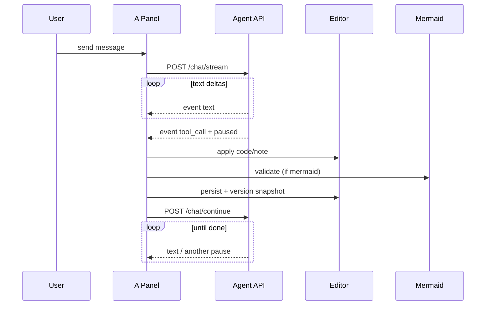

# Mermaid Studio — Architecture

This document describes the architectural decisions, patterns, and implementation details of **Mermaid Studio** so an agent (or developer) can recreate the project from scratch with equivalent behavior and structure.

---

## 1. Product overview

**Mermaid Studio** is a browser-based diagram workspace for creating, editing, organizing, and exporting [Mermaid](https://mermaid.js.org/) diagrams. Core capabilities:

| Capability | Description |
|------------|-------------|
| Diagram editor | Split-pane workspace: code/note editor + live SVG preview |
| Local persistence | IndexedDB via Dexie — no backend database |
| Folder organization | Hierarchical folder paths (`work/projects/foo`) |
| Templates | Static catalog of starter diagrams |
| Version history | Throttled snapshots with diff preview and restore |
| AI assistant | Streaming chat via OpenRouter; agent edits diagram code and notes through client-validated tools |
| Export | SVG, PNG, `.mmd` source; copy to clipboard |

**Explicit non-goals (current version):**

- No user authentication or multi-tenant cloud sync
- No server-side diagram storage
- Settings, Help, Upgrade to Pro, and Examples nav items are UI placeholders
- `/examples` redirects to `/templates`

---

## 2. System context

```mermaid
flowchart TB
  subgraph Browser["Browser (React SPA)"]
    UI[Pages & Components]
    Dexie[(IndexedDB / Dexie)]
    Mermaid[Mermaid.js render/validate]
    UI --> Dexie
    UI --> Mermaid
  end

  subgraph DevProxy["Vite dev proxy /api → :3001"]
    Proxy[Proxy]
  end

  subgraph NodeServer["Node.js Agent API (Hono)"]
    Routes[/api/agent/*]
    OR[OpenRouter SDK]
    Sessions[In-memory session store]
    Routes --> OR
    Routes --> Sessions
  end

  UI -->|SSE + JSON| Proxy --> Routes
  OR -->|LLM API| OpenRouter[(OpenRouter)]
```

**Key architectural split:**

- **Frontend owns all diagram data** (IndexedDB).
- **Backend is a thin AI proxy** — holds API keys, runs the OpenRouter agent, streams tokens, and pauses for client-side tool execution.
- **Mermaid validation/rendering runs in the browser** so the agent receives real parse/render feedback.

---

## 3. Technology stack

### Runtime & tooling

| Layer | Choice | Rationale |
|-------|--------|-----------|
| Package manager | `pnpm` | Project convention |
| Language | TypeScript ~6 | Strict typing across client and server |
| Bundler | Vite 8 | Fast HMR, ESM-native |
| React | 19 | UI framework |
| Router | react-router-dom 7 | File-based mental model with explicit routes |
| Server | Hono 4 on Node (`@hono/node-server`) | Lightweight, SSE-friendly |
| Server runner | `tsx` (dev watch + prod) | No separate compile step for server |

### Libraries

| Concern | Library |
|---------|---------|
| Local DB | Dexie 4 + dexie-react-hooks |
| Diagrams | mermaid 11 |
| AI | `@openrouter/agent` 0.7 |
| Validation | zod 4 |
| Icons | lucide-react |
| Markdown (AI messages, notes) | react-markdown + remark-gfm + rehype-sanitize |
| Styling | Plain CSS (design tokens in `src/styles/gemini.css`) — **no Tailwind** |

### TypeScript project references

```
tsconfig.json          → references app + node configs
tsconfig.app.json      → src/** (React app)
tsconfig.server.json   → server/** (Node agent API)
```

Build: `tsc -b && vite build` (typecheck both projects, bundle client only).

---

## 4. Repository layout

```
mermaid-plan/
├── index.html                 # SPA shell, Inter + Fira Code fonts
├── vite.config.ts             # React plugin + /api proxy to :3001
├── package.json
├── .env.example               # OPENROUTER_API_KEY, optional overrides
├── architecture.md            # this file
│
├── server/                    # Node agent API (not bundled by Vite)
│   ├── index.ts               # dotenv + serve Hono app
│   ├── app.ts                 # CORS, health, route mounting
│   ├── config.ts              # env parsing
│   ├── types.ts               # API request/response types
│   ├── routes/
│   │   └── agent.ts           # /chat, /chat/stream, /chat/continue
│   └── agent/
│       ├── client.ts          # singleton OpenRouter client
│       ├── prompts.ts         # system instructions + diagram context
│       ├── runAgent.ts        # callModel setup
│       ├── streamRun.ts       # SSE text + tool_call + paused/done
│       ├── ephemeralState.ts  # request-scoped StateAccessor (no Map/TTL)
│       └── tools/
│           ├── index.ts
│           ├── clientTools.ts # marks client-handled tool names
│           ├── updateMermaid.ts # execute: false
│           └── updateNote.ts    # execute: false
│
└── src/
    ├── main.tsx               # StrictMode + RouterProvider
    ├── router.tsx             # createBrowserRouter, loaders, errorElement
    ├── App.tsx                # AppShell outlet
    ├── index.css              # global reset + gemini.css import
    ├── config/
    │   └── storage.ts         # db name, autosave, versioning knobs
    ├── context/
    │   ├── SidebarContext.tsx
    │   ├── sidebar-context.ts
    │   └── EditorContext.tsx  # scoped to EditorSession
    ├── data/                  # static seed + templates (not persisted logic)
    │   ├── types.ts           # DiagramRecord, Template, etc.
    │   ├── diagrams.ts        # seed diagrams + folders
    │   ├── templates.ts       # template catalog
    │   ├── defaultEditorCode.ts
    │   └── index.ts
    ├── hooks/
    ├── lib/
    │   ├── db/                # Dexie schema + repositories
    │   ├── agent/             # client SSE consumer
    │   ├── diagram/
    │   ├── mermaid/
    │   ├── folders/
    │   ├── diff/
    │   └── exportDiagram.ts
    ├── pages/
    └── components/
        ├── AppLayout.tsx
        ├── AppSidebar.tsx
        └── editor/            # editor-specific UI
```

---

## 5. Frontend architecture

### 5.1 Routing

| Path | Component | Behavior |
|------|-----------|----------|
| `/` | `MyDiagramsPage` | Dashboard: folders + recent/diagrams in folder |
| `/diagrams` | redirect → `/` | Legacy alias |
| `/templates` | `TemplatesPage` | Template gallery |
| `/examples` | redirect → `/templates` | Legacy alias |
| `/editor` | loader | `createDiagram` + `redirect(/editor/:id)` |
| `/editor/:id` | `EditorPage` | Main editor session; loader hydrates diagram |

**Folder navigation on dashboard** uses query param `?path=foo/bar`, not nested routes.

**New diagram flow (critical):**

1. Never navigate to `/editor/:id` without first persisting a `DiagramRecord`.
2. `startNewDiagram(navigate, input?)` in `src/lib/diagram/startNewDiagram.ts`:
   - Calls `createDiagram()` → IndexedDB
   - `navigate(`/editor/${record.id}`)`
3. `useStartNewDiagram` hook wraps this with a `creating` guard for button disabled state.
4. `/editor?folderPath=...` supports optional folder via `newDiagramLoader`.

Default new diagram code is **empty string** (`emptyEditorCode`), not a sample flowchart.

### 5.2 Layout & navigation shell

```
SidebarProvider (context)
  └── RouterProvider (root loader: ensureDbReady)
        └── AppShell
              └── route pages + errorElement
                    ├── AppSidebar (collapsible, mobile drawer)
                    └── main-content
```

- **Sidebar state**: `collapsed` persisted in `localStorage` (`sidebar-collapsed`).
- **Mobile**: drawer + backdrop; closes on route change; `body overflow: hidden` when open.
- **Editor** uses `embedMobileMenu` so `TopBar` embeds `MobileMenuButton` instead of a separate mobile bar.

### 5.3 Page responsibilities

| Page | Data source | Key hooks |
|------|-------------|-----------|
| `MyDiagramsPage` | Dexie live queries | `useFolderBrowser`, `useStartNewDiagram` |
| `TemplatesPage` | Static `templates` array | `useStartNewDiagram` (blank or via `TemplateCard`) |
| `EditorPage` | Loader + per-diagram | `useDiagramEditor`, `useDebouncedPreview`, `EditorProvider` |

### 5.4 Editor workspace layout

```
EditorPage
  └── EditorSession (keyed by diagram id)
        ├── TopBar (title, folder, save status, history, export)
        └── .workspace (flex row)
              ├── CodeEditor (left panel)
              │     ├── tabs: Code | Note
              │     ├── line-number textarea (code)
              │     ├── NoteEditor / MarkdownPreview (note)
              │     ├── TemplateSelect dropdown
              │     ├── Validate button
              │     └── AiPanel overlay (when open)
              └── Preview (right panel)
                    ├── MermaidRender (debounced code)
                    ├── pan/zoom viewport
                    └── ExportDropdown
```

**Panel modes:** `EditorPanelMode = 'code' | 'note'`

**Preview debouncing:** `useDebouncedPreview(code, 300ms)` — editor typing does not re-render Mermaid on every keystroke.

**Save status:** `'saved' | 'saving' | 'dirty' | 'error'` — shown in TopBar; `beforeunload` warns on dirty/saving.

### 5.5 Component conventions

- **No global state library** (no Redux/Zustand). State lives in hooks + React context (sidebar only).
- **Repository pattern** for IndexedDB — components/hooks never call `db.*` directly except via `lib/db/*Repository.ts`.
- **Live queries**: `useLiveQuery` from dexie-react-hooks for reactive lists (diagrams, folders, versions).
- **Icons**: lucide-react, 14–16px in dense UI.
- **Class names**: semantic BEM-ish (`ai-panel-messages`, `version-history-item`). Utility `cn()` for conditional classes.
- **CSS**: co-located `Component.css` for editor panels; global design system in `src/styles/gemini.css` (CSS variables: `--gemini-bg`, `--gemini-text`, tint classes for folder cards).

### 5.6 Mermaid integration

**Single initialization** in `MermaidRender.tsx`:

```ts
mermaid.initialize({
  startOnLoad: false,
  theme: 'default',
  securityLevel: 'loose',
  fontFamily: 'Inter, sans-serif',
  flowchart: { htmlLabels: true, curve: 'basis', padding: 16, useMaxWidth: false },
  sequence: { useMaxWidth: false },
  mindmap: { useMaxWidth: false },
})
```

**Render flow (`MermaidRender`):**

1. Increment render sequence; unique id per render (`mermaid-${useId}-${seq}`).
2. `mermaid.render(id, code)` → inject SVG, call `bindFunctions`.
3. On unmount/cancel: cleanup hidden DOM artifacts via `cleanupMermaidRenderElement`.
4. Errors: user-friendly message in prod; full error in dev (`import.meta.env.DEV`).

**Validation (`validateMermaidDiagram`):**

1. `mermaid.parse(code)` → phase `parse` on failure
2. `mermaid.render(id, code)` → phase `render` on failure
3. Success → `{ ok: true, diagramType }` via `detectDiagramType`

**Diagram type detection:** first non-comment line's first token, mapped through `TYPE_MAP` (e.g. `flowchart` → `Flowchart`). Default: `Flowchart`.

---

## 6. Data layer (IndexedDB / Dexie)

### 6.1 Schema

Database name: `MermaidStudio` (from `storageConfig.dbName`).

| Table | Primary key | Indexed fields | Purpose |
|-------|-------------|----------------|---------|
| `diagrams` | `id` (UUID) | `folderPath`, `updatedAt`, `starred`, `title` | Current diagram state |
| `folders` | `path` | `createdAt` | Explicit folder records |
| `diagramVersions` | `id` | `diagramId`, `createdAt` | Point-in-time snapshots |
| `conversations` | `diagramId` | `updatedAt` | AI chat history per diagram |

**Schema versions:**

- `v1`: diagrams, folders, diagramVersions
- `v2`: adds `conversations`

### 6.2 Core types (`src/data/types.ts`)

```ts
interface DiagramRecord {
  id: string
  title: string
  mermaidCode: string
  noteMd?: string
  folderPath: string      // normalized path; '' = root
  type: string            // detected from code
  starred: boolean
  createdAt: string       // ISO
  updatedAt: string
}

interface DiagramVersionRecord {
  id: string
  diagramId: string
  mermaidCode: string
  noteMd?: string
  title: string
  commitMessage?: string  // from AI tool calls
  createdAt: string
}

interface ConversationRecord {
  diagramId: string       // also primary key
  messages: StoredChatMessage[]
  updatedAt: string
}
```

### 6.3 Repository APIs

**diagramRepository:**

- `listDiagrams({ folderPath? })` — sorted by `updatedAt` desc
- `getDiagram`, `createDiagram`, `updateDiagram`, `deleteDiagram`, `toggleStar`
- `deleteDiagram` cascades versions + conversation in a transaction

**folderRepository:**

- `listAllFolderPaths`, `createFolder`, `deleteFolder` (if used)
- Folders also implied by diagram `folderPath` values

**versionRepository:**

- `listVersions`, `createVersionSnapshot`, `restoreVersion`, `pruneOldSnapshots`
- Max 50 snapshots per diagram (`storageConfig.versioning.maxSnapshotsPerDiagram`)

**conversationRepository:**

- `getConversation`, `saveConversation`, `clearConversation`
- Keyed by `diagramId` (1:1 with diagram)

### 6.4 Seed data

On first DB open (`on('populate')`):

1. Load `seedDiagrams` and `seedFolders` from `src/data/diagrams.ts`
2. Create `DiagramRecord` for each seed
3. Create initial version snapshot per diagram
4. Register folder paths in `folders` table

After populate, all user data is local mutations.

### 6.5 Folder path model

- Paths are **string-based**, `/`-separated, normalized (trim segments, no leading/trailing slashes).
- Root = `''`.
- Utilities in `src/lib/folders/pathUtils.ts`: `normalizeFolderPath`, `getChildFolderPaths`, `getBreadcrumbSegments`, `countDiagramsInSubtree`, etc.
- Dashboard reads `?path=` from URL; child folders derived from union of folder table + diagram paths.

### 6.6 Autosave & versioning policy

From `src/config/storage.ts`:

```ts
{
  dbName: 'MermaidStudio',
  autosaveDebounceMs: 1500,
  versioning: {
    enabled: true,
    throttleMs: 60_000,           // min interval between auto snapshots
    maxSnapshotsPerDiagram: 50,
  },
}
```

**`useDiagramEditor` persist logic:**

1. On title/code/noteMd/folderPath change → mark dirty → debounce 1500ms → `updateDiagram`
2. Auto snapshot when content changed AND throttle elapsed
3. Agent saves (`applyAgentDiagramUpdate` / `applyAgentNoteUpdate`) always snapshot immediately with optional `commitMessage`
4. `isSavingRef` prevents concurrent saves

### 6.7 DB readiness

`useDbReady` calls `db.open()` once; exposes `{ ready, loading, dbError }`. Pages show banners on `dbError` but still attempt graceful degradation.

---

## 7. AI agent architecture

This is the most distinctive part of the system: **server-side LLM with client-executed tools**.

### 7.1 Why client-handled tools?

Mermaid must be validated and rendered in the browser. The agent proposes diagram/note changes; the client:

1. Applies changes to editor state
2. Validates (mermaid) or saves (note)
3. Returns structured tool result to server
4. Server resumes agent run with tool output

Server tool definitions use `execute: false` in `@openrouter/agent/tool`.

### 7.2 Tools

| Tool | Input | Client action | Result |
|------|-------|---------------|--------|
| `update_mermaid` | `{ code, commitMessage? }` | Set code, `validateMermaidDiagram`, persist + snapshot | `{ ok, diagramType? }` or `{ ok: false, phase, error }` |
| `update_note` | `{ noteMd, commitMessage? }` | Set note, persist + snapshot | `{ ok: true }` or `{ ok: false, error }` |

### 7.3 API endpoints

Base: `/api/agent` (proxied in dev).

| Method | Path | Mode | Purpose |
|--------|------|------|---------|
| POST | `/chat` | JSON | Non-streaming (full response) — optional, not used by UI |
| POST | `/chat/stream` | SSE | Primary UI path — stream text, pause on tool call |
| POST | `/chat/continue` | SSE | Resume after client tool result |
| GET | `/api/health` | JSON | `{ ok, agentConfigured, defaultModel }` |

**Auth:** `OPENROUTER_API_KEY` in server env. If missing → 503 with helpful message.

**CORS:** localhost origins only for `/api/*`.

### 7.4 Request payloads

**Chat stream request:**

```ts
{
  messages: { role: 'user' | 'assistant', content: string }[]
  diagramCode?: string
  noteMd?: string
  diagramTitle?: string
  model?: string
}
```

**Continue request:**

```ts
{
  conversationState: unknown
  toolCallId: string
  toolCallName: 'update_mermaid' | 'update_note'
  toolResult: MermaidToolResult | NoteToolResult
  diagramCode?: string
  noteMd?: string
  diagramTitle?: string
  model?: string
}
```

### 7.5 SSE event protocol

| Event | Payload | Meaning |
|-------|---------|---------|
| `meta` | `{ model }` | Stream started |
| `text` | `{ delta }` | Token chunk |
| `tool_call` | `{ id, name, arguments }` | Client-handled tool invoked |
| `paused` | `{ toolCallId, reason, conversationState }` | Stream stops; client echoes state on /continue |
| `done` | `{ message, usage? }` | Completed without pause |
| `error` | `{ error }` | Fatal |

Client parser: `src/lib/agent/streamChat.ts` — `eventsource-parser` over `fetch` ReadableStream.

### 7.6 Stateless agent continue

`server/agent/ephemeralState.ts`:

- Request-scoped `StateAccessor` per `/chat/stream` or `/chat/continue` call
- On `paused`, server emits `conversationState` from accessor; client round-trips it on continue
- No in-memory `Map`, no TTL, survives server restart mid-tool-loop
- Shared Zod schemas in `shared/agent/schemas.ts`

### 7.7 Agent run configuration

- Default model: `openai/gpt-4o-mini` (override `OPENROUTER_MODEL`)
- Max steps: 8 (`stepCountIs(8)`)
- Instructions: `buildInstructions()` = system prompt + optional diagram context block
- System prompt rules: use tools for edits, validate retry loop, note is viewer-facing markdown, etc. (`server/agent/prompts.ts`)

### 7.8 Client UI flow (`useAgentChat` + `AiPanel`)



**Conversation persistence:**

- Loaded from `conversations` table on diagram mount
- Saved debounced 500ms after message changes
- Reset clears IndexedDB conversation
- Welcome message (`id: 'welcome'`) is UI-only, not persisted
- Message IDs: `user-N`, `assistant-N` monotonic counter

**Refs for agent context:** `diagramCodeRef`, `noteMdRef`, `diagramTitleRef` always hold latest values during multi-step tool loops.

---

## 8. Export pipeline

`src/lib/exportDiagram.ts`:

1. `mermaid.render` → SVG string
2. **SVG download** — Blob `image/svg+xml`
3. **PNG** — SVG → Image → Canvas (2x scale, white background) → Blob
4. **`.mmd`** — plain text source
5. `sanitizeFilename(title)` for downloads

Export uses latest **non-debounced** `editor.code` (`exportCode` prop), not debounced preview code.

---

## 9. Version history & diff

- Snapshots listed newest-first in `VersionHistoryPanel`
- Diff via `summarizeVersionDiff` (`src/lib/diff/versionDiff.ts`) comparing consecutive snapshots
- Line diff utilities in `src/lib/diff/lineDiff.ts`
- Restore confirms via `window.confirm`, calls `restoreVersion` → updates diagram + editor state

---

## 10. Templates

- Static array in `src/data/templates.ts` with categories in `templateCategories`
- `TemplateCard` calls `startNewDiagram({ title, mermaidCode, noteMd })` or opens in editor
- In-editor `TemplateSelect` applies template to **current** diagram (with confirm if code non-empty) via `applyTemplate` in `useDiagramEditor`

---

## 11. Configuration & environment

### Server (`.env`)

| Variable | Default | Purpose |
|----------|---------|---------|
| `OPENROUTER_API_KEY` | — | Required for agent |
| `OPENROUTER_MODEL` | `openai/gpt-4o-mini` | Default LLM |
| `PORT` | `3001` | Agent API port |
| `HOST` | `127.0.0.1` | Bind address |

### Client (`src/config/storage.ts`)

Tune autosave debounce, versioning throttle, max snapshots, DB name.

### Vite proxy

```ts
server: {
  proxy: { '/api': { target: 'http://127.0.0.1:3001', changeOrigin: true } }
}
```

---

## 12. Development workflow

```bash
pnpm install
cp .env.example .env   # add OPENROUTER_API_KEY

# Frontend only
pnpm dev               # http://localhost:5173

# Agent API only
pnpm dev:server        # http://127.0.0.1:3001

# Both in parallel
pnpm dev:all
```

**Scripts:**

| Script | Action |
|--------|--------|
| `dev` | Vite dev server |
| `dev:server` | tsx watch server |
| `dev:all` | parallel dev + dev:server |
| `build` | `tsc -b && vite build` |
| `server` | production agent server |
| `lint` | eslint |

---

## 13. Deployment considerations

**Frontend:** static `dist/` from Vite — any static host.

**Agent API:** Node process running `tsx server/index.ts` or compiled equivalent. Must:

- Receive `OPENROUTER_API_KEY`
- Be reachable from browser at `/api` (reverse proxy or matching origin)
- Update CORS in `server/app.ts` if not localhost

**IndexedDB:** per-browser, per-origin — no server backup.

---

## 14. Error handling patterns

| Area | Pattern |
|------|---------|
| DB open failure | `dbError` string + banner; `useDbReady` still sets `ready: true` |
| Diagram not found | Editor shows "Diagram not found." |
| Agent misconfigured | 503 JSON; UI shows error in chat bubble |
| Agent stream | `AgentChatError` with status; abort via `AbortController` |
| Mermaid render | Inline error panel in preview |
| Save failure | `saveStatus: 'error'` in TopBar |

---

## 15. Accessibility & UX details

- AI panel: `role="dialog"`, `aria-label`
- Mermaid SVG: `role="img"`
- Render errors: `role="alert"`
- Folder breadcrumbs: `aria-label="Folder path"`
- Keyboard: Enter sends AI message (Shift+Enter newline)
- Mobile sidebar: backdrop button closes drawer

---

## 16. Recommended implementation order (from scratch)

Use this sequence to rebuild with working increments:

### Phase 1 — Scaffold

1. Vite + React + TS + react-router-dom
2. `gemini.css` design tokens + `AppLayout` + `AppSidebar`
3. Routes shell (`/`, `/templates`, `/editor/:id`)

### Phase 2 — Local data

4. Dexie schema v1 + seed populate
5. `diagramRepository`, `folderRepository`
6. `MyDiagramsPage` with folder browser + diagram cards
7. `startNewDiagram` + `NewEditorRedirect`

### Phase 3 — Editor core

8. `useDiagramEditor` with autosave
9. `CodeEditor` (textarea + line numbers)
10. `MermaidRender` + `Preview` with debounce
11. `TopBar` (title, save status)

### Phase 4 — Editor features

12. Note tab + markdown preview
13. Version repository + history panel + diff
14. Export dropdown
15. Templates page + template apply
16. Preview pan/zoom (`usePreviewViewport`)

### Phase 5 — AI

17. Hono server + health + config
18. OpenRouter agent + tools (`execute: false`)
19. SSE stream + session store
20. `streamChat.ts` client
21. `AiPanel` with pause/continue loop
22. Dexie `conversations` v2 + persist chat

### Phase 6 — Polish

23. Validate button in code editor
24. Mobile sidebar behavior
25. Error banners, beforeunload guard
26. `.env.example`, README updates

---

## 17. Key invariants (do not break)

1. **Diagram IDs are created in IndexedDB before navigation** to `/editor/:id`.
2. **Agent tools are validated on the client** — server never runs Mermaid.
3. **Debounced preview, immediate export** — preview uses debounced code; export uses live code.
4. **Folder paths are always normalized** before save/query.
5. **Agent continue is stateless** — client round-trips `conversationState` from `paused` events.
6. **Version snapshots** store full `mermaidCode`, `noteMd`, `title` — not patches.
7. **Conversation key === diagramId** — resetting chat is per-diagram.
8. **Empty new diagrams** start with `emptyEditorCode` (`''`), not a sample.

---

## 18. Static seed vs runtime data

| Source | Used for |
|--------|----------|
| `src/data/diagrams.ts` | Initial IndexedDB populate only |
| `src/data/templates.ts` | Template gallery (always static) |
| `src/data/types.ts` `Diagram` / `Folder` | **Deprecated** seed UI types — use `DiagramRecord` |

---

## 19. Extension points

| Feature | Natural hook |
|---------|--------------|
| Cloud sync | Replace repositories with API-backed implementations |
| Auth | Wrap routes; add userId to Dexie schema |
| Examples page | Replace redirect in `App.tsx` |
| Settings | Sidebar footer button |
| Server-side tools | Set `execute: true` + handler (not recommended for Mermaid) |
| Multiple AI models | Pass `model` in chat request; expose in UI |

---

## 20. File checklist (84 source files)

When recreating, ensure these functional areas exist (names matter for consistency):

- **Pages (3):** `MyDiagramsPage`, `TemplatesPage`, `EditorPage`
- **Editor components (10):** `CodeEditor`, `Preview`, `TopBar`, `AiPanel`, `NoteEditor`, `MarkdownPreview`, `TemplateSelect`, `FolderSelect`, `ExportDropdown`, `VersionHistoryPanel`
- **Shared components (10):** `AppLayout`, `AppSidebar`, `DiagramCard`, `FolderCard`, `TemplateCard`, `PageHeader`, `SearchInput`, `MermaidRender`, `Logo`, `MobileMenuButton`, `StarButton`
- **Hooks (14):** `useDiagramEditor`, `useAutosave`, `useDebouncedValue`, `useDebouncedEffect`, `useAgentChat`, `usePersistedConversation`, `useDbReady`, `useFolderBrowser`, `useStartNewDiagram`, `useDebouncedPreview`, `usePreviewViewport`, `useSidebar`, `useLocalStorage`, `useMediaQuery`
- **DB (5):** `mermaidStudioDb`, `diagramRepository`, `folderRepository`, `versionRepository`, `conversationRepository`
- **Agent client (2):** `streamChat.ts`, `types.ts`
- **Server (11):** index, app, config, types, agent route, client, prompts, runAgent, streamRun, ephemeralState, 3 tool files
- **Shared (2):** `shared/agent/schemas.ts`, `shared/agent/types.ts`

---

*This document reflects the codebase as of the `mermaid-plan` package (React 19, Mermaid 11, OpenRouter Agent 0.7, Dexie 4). Update it when schema versions, routes, or agent protocols change.*
